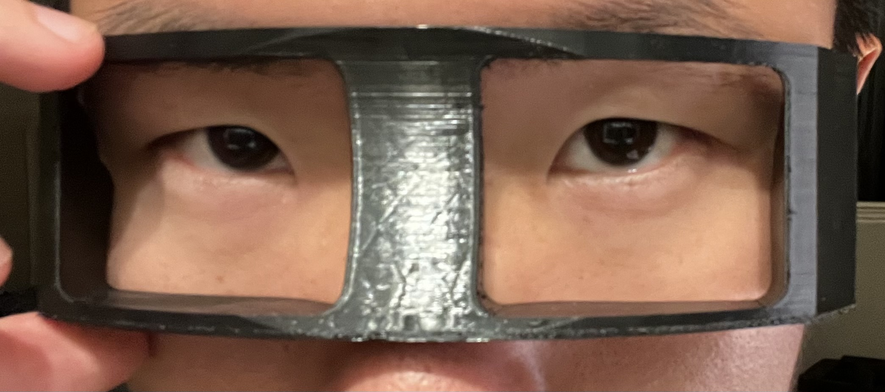

TO DO FOR THIS DOCUMENT: 
- [ ] Photo of me putting the cushion on the face
- [ ] Link to my video
- [ ] Link to the GitHub project files
## About me
**Name**: Mingzhou (Ming) Gu
**Background**: Industrial and Product Design
**Skills Related to Computational Design**: CAD (*Solidworks*, *Fusion 360*); Sketching (*Gravity Sketch*)

## Outcome
Screenshots from *Rhino*: 

Renderings from *Keyshot*: 

Final Prototype: 

The first, second, and third iterations from left, right to bottom: 

*Grasshopper* map: 

## Process
### Challenge Level
I chose the **Axolotl** level. 

I had no previous knowledge of *Rhino* or *Grasshopper*. Transferring CAD knowledge helped me with my own design, but most of the help came from TJ's tutorials and asking ChatGPT questions. 

### Personalization
The personalization

### Challenges
The results of the challenge [inputs, modeling, etc.]

## Speculations
### User Experience
The custom facial cushion significantly improves the “immersion” of VR experiences. 

### Engineering and Manufacturing
also low-cost compared to bumping up the brightness of LED panels. 
3. **AI**: Advanced algorithms need to automate the manual adjustment of inputs (facial scanning data). 

**Conclusion**: 
The custom facial cushion may become a standard feature for VR as 3D scanning becomes more accessible and accurate. Much like the custom optical lens for virtual reality headsets, the facial cushion may have its own third-party services available for most models of headsets. 

## Next Steps
1. Work on the VR Goggle design
2. Soften the edges of the cushion based on the goggle design
3. Explore the porosity of materials (use the flexible TPU as a baseline)
4. Test the algorithm on another 2 people's face

## Links
