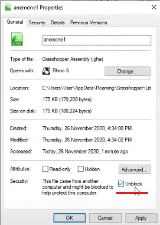
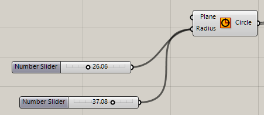
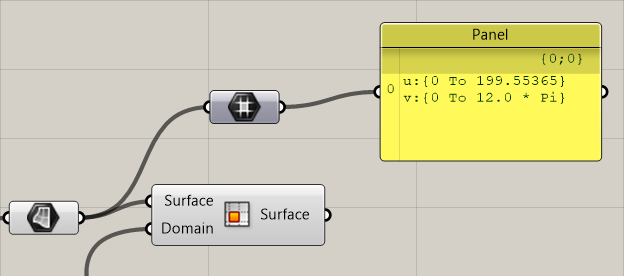
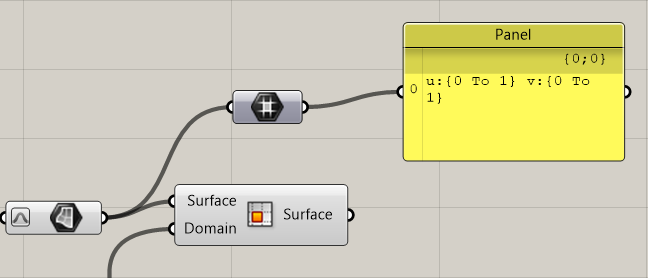

live notes for *Grasshopper (Win)* 

---

Unanswered Questions: 
- [ ] What is a *Domain*?
- [ ] What is *UV*?

---
## Find Plugins
food4rhino.com
grasshopper3d.com -> groups

### Installation (GHA)
1. Download the file
2. Place under the components folder of Rhino
	1. Rhino: File -> Special Folders -> Components
3. Under file properties, check "Unblock"
	1. 
4. Restart Rhino to use 

### Plugin List
- [x] Bifocal
- [ ] Anemone - create loops in simulations
- [x] Weaverbird - greater controls in mesh geometries
- [ ] Chromodoris - isosurfacing
- [x] Kangaroo Physics - live physics engine
- [x] Lunchbox -  exploring mathematical shapes, paneling, structures, and workflow
- [ ] BrickBox

#### BrickBox
1. Select components
2. Click on the yellow BrickBox icon
3. Input name of the new *tab* and *descriptions*
4. Click on the checkbox and "Done"
5. The *snippet* is ready for use

## Basic
### Operations
**Click middle mouse button -> Group** to group elements

**Hold Ctrl + Drag** to disconnect elements

**Hold Shift + Drag** Creates two nodes

### Components
**(Quick) Number Slider**: 
1. *Double click* on an empty space or hit *space*
2. Type "12..50.00"
	1. 12 = minimum
	2. 50 = maximum
	3. accuracy = 2 digits

**Panel**: 
Use this to see **output** results. 

**Reparameterize**
Usage: curve, surface, etc. 
1. right click on the *surface* element
2. Click "Reparameterize"
3. Notice the parameter value changes in the *Panel*

