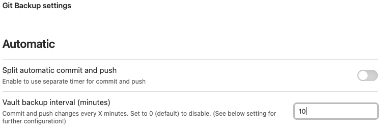
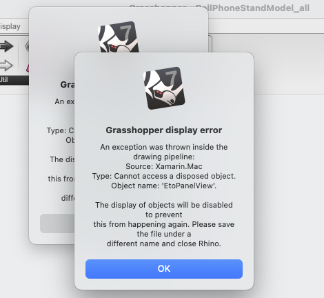
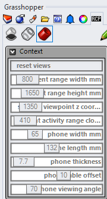
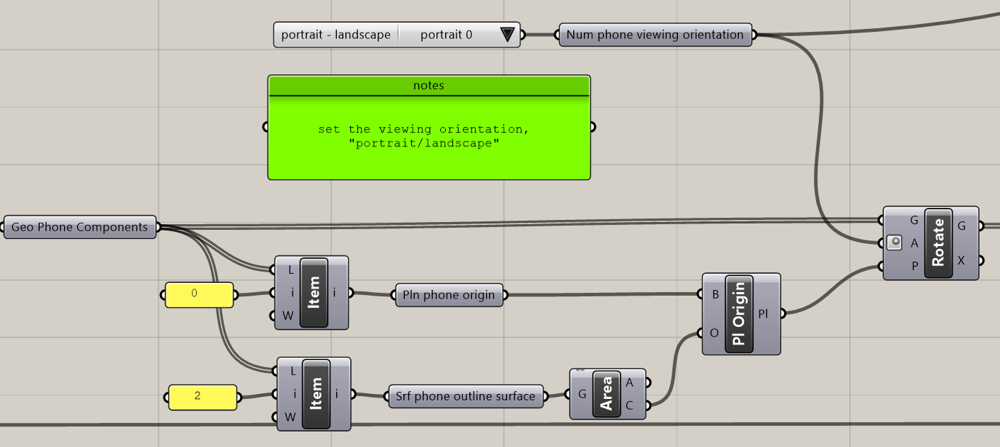
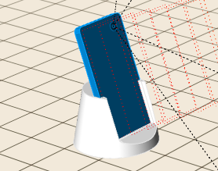
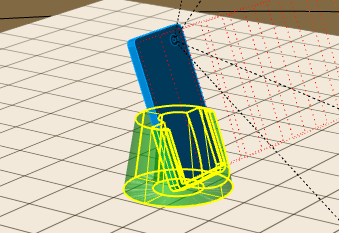
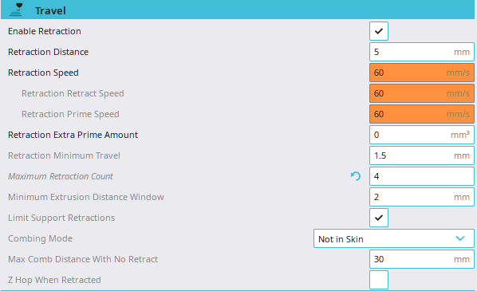

Link back to [README.md](../README.md)

---

**note:** 
In every week's progress report, I will list **Reflections** and **Speculations** at front (like a TL,DR version) and put longer notes below them. 

---
# Reflections
- Learned how to use basic Markdown in *GitHub*
- Set up synchronization between *Obsidian* and *GitHub* using git
	- Writing in the *Obsidian* is just easier. I'm glad to set up the sync.   
- Basic understanding of *Grasshopper*
	- This is a good start but not enough yet. I still need to understand how to model from 0 to 1.  
- Learned an important setting in 3D printings
	- 3D printings are not easy for some geometries. Running a test print is always a good idea. 

# Speculations
- The computational design method can be used for **wearable products** that needs deep customization. 
	- e.g., the facial cushion of [*Bigscreen VR* headset](https://www.bigscreenvr.com/) utilizes 3D scanning and additive manufacturing to create one of the most immersive experiences (See [this review video](https://www.youtube.com/watch?v=obAhWP9vkhU&pp=ygUTYmlnIHNjcmVlbiB2ciBzYWRseQ%3D%3D) for more details)
	- e.g., [ShapeDiver](**https://shapediver.com/**) has many parameter-based products for reference
- Incorporate *Gravity Sketch* in the Industrial Design workflow may be **revolutionary.** 

## Next steps:
1. Computational Design - modeling a face cushion
	- learn to model with *Grasshopper*
	- research parameters for designing the facial cushion for a VR headset
	- model the facial cushion!
2. Experiment *Gravity Sketch* physical prototyping workflow
	- try to print a model imported from *Gravity Sketch*
	- maybe record the process if I can to see how fast it is
	- I will try the Unity workflow in a later timeline. 

---
# Sync between Obsidian and GitHub
To synchronize between *Obsidian* and *GitHub*, I tried two methods in success: 
## Method 1: Obsidian Git (HTTP on Mac)
Following [*Obsidian Git* documentation](https://publish.obsidian.md/git-doc/Getting+Started), I got error messages like this one: 


There seemed to be authentication problems in Git, which I had no clue of. 

### Solutions
The current solution is to  [generate a personal token](https://linked-blog-starter.vercel.app/connect-obsidian-vault-with-github) in the *GitHub* settings and include it in the repository path like this: 
```
https://<PERSONAL_ACCESS_TOKEN>@github.com/<USERNAME>/<REPO>.git
```

There is [another solution](https://kattsun.dev/posts/2021-05-28-obsidian-git-authentication-error/) that does not use tokens. After typing this command in the terminal (Mac), choose "always allow."

```
git config --global credential.helper osxkeychain
```

### Backup
- For automatic backup, the number of *Vault backup interval* cannot be zero:



- To manually push changes, use either of the following commands:
```
obsidian git: commit
obsidian git: push
```
or
```
obsidian git: create backup
```

## Method 2: GitHub Desktop 
The easiest way is to stall [*GitHub Desktop*](https://desktop.github.com) and set the local folder inside an existing Obsidian Vault. The workflow will be: 
1. Make changes in *Obsidian*
2. Review changes
3. Commit and push in *GitHub Desktop*
4. Multiple changes will require manual input of "Summary."

However, for the **Simplicity** of having everything in one app (*Obsidian*), I later deleted *GitHub Desktop* and used the *Obsidian Git* Plugin method. 

---

# Markdown - the GitHub way
This section is about transferring previous markdown knowledge for *GitHub* use. 

See [here](../projects/documents/_GitHub_Favored_Markdown.md) for notes about the mixed use of the markdown language in *Obsidian* and *GitHub*.

Resources: 
- [GitHub Markdown Documentation](https://docs.github.com/en/get-started/writing-on-github/getting-started-with-writing-and-formatting-on-github) - General guide for GitHub writing
- [Obsidian Markdown Guide](https://www.markdownguide.org/tools/obsidian/) - Use this to check which ones are available in *Obsidian*

---

# Computational Design
Opening files from Mac often surprises me - you just can't assume it being normal just because it worked yesterday: 


The problem was that I could not see anything in Grasshopper. Half of things worked in the .3dm file but that was not enough. 


A designer friend once said that Macs don't like Rhino (or the other way around), so I tried opening from *Windows*. **It worked!**

## CellPhoneStandModel.gh
1. Change parameters can be done in two places:
	1. Rhino -> Properties Panel -> Grasshopper: drag handle (cannot type exact numbers)
		
	2. Directly in Grasshopper: can type numbers 

## Grasshopper
**Basic**
- Add a node:
	- use the **toolbar** to add
	- double click on the blank space or hit space to **search and add**

## "Bake"
If the geometry is not *baked*, it is not selectable in Rhino. When the *Grasshoppper* window is closed, these will disappear. 

Unbaked: 

Baked: 


---
# Gravity Sketch Workflow
Learned new (*Industrial Design*) workflows from another designer. 

I may further develop this topic in another dedicated journal. 

1. **Physical Mockup**: Sketch in *Gravity Sketch* (ideation phase) -> clean up scenes -> export ideal forms -> 3D print separately
2. **Interactive Mockup**: Model in *Gravity Sketch* (development phase) -> export to *Unity Engine* -> add interactions

The *Physical Mockup* workflow is easier to adopt and has value for many traditional ID applications because it includes physical feedback. 

The *Interactive Mockup* seems more suitable for storyboards (user actions in context). **However, *ShapesXR* can be a better fit since it does not require coding.** 

---

# 3D Printing - Retraction Settings



[Here](https://all3dp.com/2/ender-3-pro-v2-retraction-settings-all-you-need-to-know/#:~:text=But%2C%20more%20importantly%2C%20too%20high,or%20even%20break%20mid%2Dprint.) is a guide I found for future reference.

The retraction settings were overlooked until I tried to print a chainmail (the picture below is from [*Thingiverse*](https://www.thingiverse.com/thing:2437081).) Small and repetitive geometries should be printed with minimum retractions.  


 