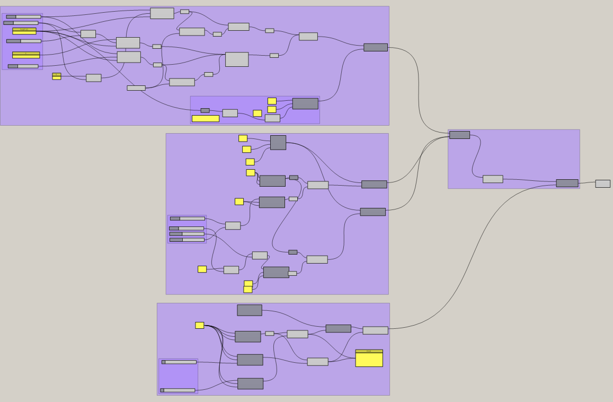
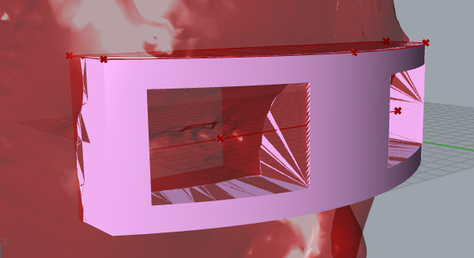

Link back to [README.md](TDF-23Fall/README.md)

---
# Reflections
- in complete sentences or paragraphs, and perhaps images or videos.
- reflections on what you learned and how you learned it
- an assessment of the state of your work

# Speculations
- in complete sentences or paragraphs, and perhaps images or videos.
- speculation on future direction for the tools (so much is changing very quickly right now, where do you think this is going? Why do you think this?)
- speculation on future direction for the work
- bonus: thoughtful descriptions of something interesting and relevant you heard about in the news or industry publications. include text, an image, a link, and a reference that you can follow up on later and share with your peers.

## Next steps:
1. Computational Design - modeling a face cushion
    - learn to model with _Grasshopper_
    - research parameters for designing the facial cushion for a VR headset
    - model the facial cushion!
2. Experiment _Gravity Sketch_ physical prototyping workflow
    - try to print a model imported from _Gravity Sketch_
    - maybe record the process if I can to see how fast it is
    - I will try the Unity workflow in a later timeline.

---

# Rhino Grasshopper

[Here](../projects/documents/Grasshopper.md) is my live notes of learning *Grasshopper*. 

This week's tutorials:
1. [Overview of Grasshopper under an hour](https://youtu.be/Y66bSN4QFUE)
2. [Installing Plugins](https://www.youtube.com/watch?v=vBh1UHg6ZHQ)
3. [From Rhino, Grasshopper to Keyshot (webinar series)]((https://www.youtube.com/playlist?list=PLO1Xwz4iyp_k6YEWaljxfbOdXANCKxJgf)

---

# Augmented Reality Fabrication
A workflow of physically building designs (especially *parametric design* in Architecture) with augmented reality. It is essentially a overlay of the digital artifact in the "corporal world". 

---

# Facial Cushion
## Parameters
Here I analyzed some key facial parameters for future references. 

The model was done in *Gravity Sketch*.

Here is the notes that visualizes these parameters on a compact VR facial cushion. 

## Practice
### 3D Scanning
I used the mobile app *Polycam* to scan my own face. It generated a FBX file that I can import to rhino. 

The scanning was processed from a set of continuous 2D photos, which impacted the accuracy.  

The file needs some re-orientation before importing to *Grasshopper*. 

### Grasshopper
The major parameters are: 
1. Face width
2. Face depth (the distance between forehead and eyes)
3. The upper curvature (lower forehead)
4. eye distance (IPD)

Here's a screenshot of the *Grasshopper* spaghettis.  

The generated geometry in *Rhino* (pink). 

### 3D Print
I used rigid PLA to test fitness. The print took about 4.5 hours on an *Ender 3v2* printer. 

The model turned out great, despite a noticeable gap (~3 mm) at the sides, which should be the result of using a single camera as the 3D scanner. This can be alleviated if I used flexible materials. 

