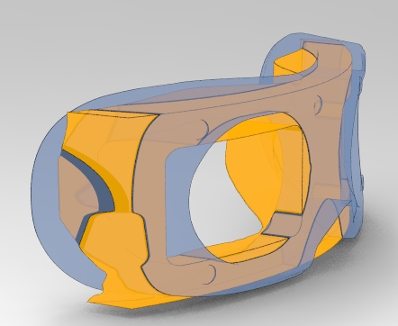
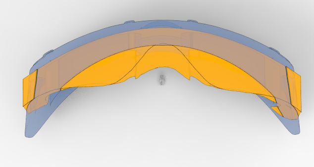
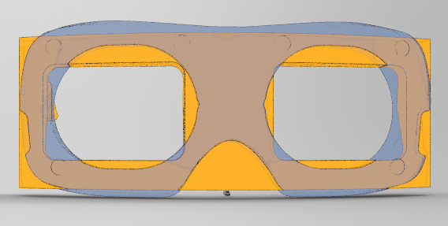
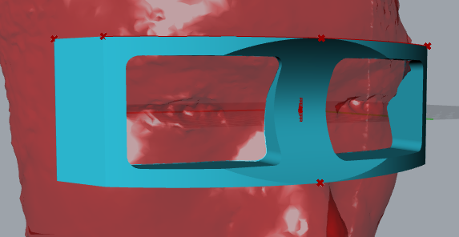
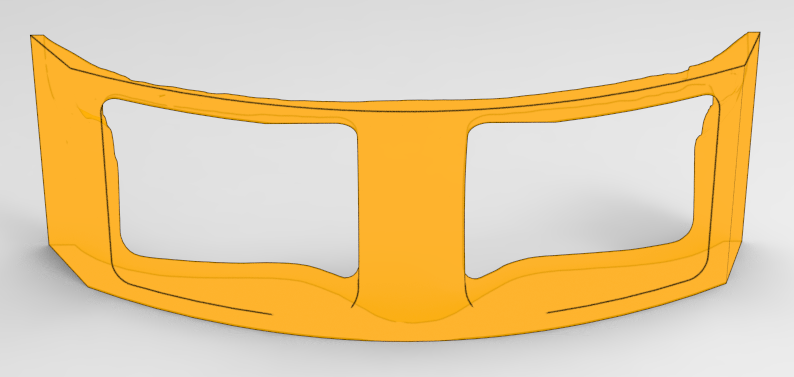
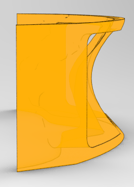

Link back to [README.md](../README.md)

---
# Reflections
- This week I focused more on the research and design of the XR goggle to pair with the cushion design I have. 
- I modified the grasshopper file to improve the geometry. 
- From Cody's presentation on Computational Design, I learned some applications of it in Architecture. It is insightful to know new fabrication methods for large projects. 

# Speculations
- The fabrication methods that utilize drones and robots can be  
- Computational Design is more than generating geometries - it is essentially a different approach to solve design problems (especially in Architecture) and a mindset 
	- Future wearable projects can utilize this approach for improved custom fit. 
	- It can also help quickly generate solutions to compare with (for example, form analysis in transportation exterior design).

# Next step:
Design the XR Goggle and modify the algorithms to create a new cushion. 

---

# Refine Design

## Analysis
Compare the second print to the geometry of the [*Bigscreen Beyond*](https://sketchfab.com/3d-models/bigscreen-beyond-official-3d-printable-model-46f3d74e7ba44037bfd2f98b05d3c20d) cushion, some improvements are needed:
1. The side geometries need more coverage
2. The eye openings can be larger (for larger FOV)
3. Add the parameter of nose curvature to reduce chunks of materials

## Implementation
Here is a photo of all three iterations (hard materials). 

The third one at the second row has a larger FOV and covered sides

# Computational Design "Deep Dive"
## When is computational design good to use:
- Increasing complexity
- Many variables
- Need for variety
- Time needed to solve problems exceeds human limits

## Examples
[Dress in Motion](https://n-e-r-v-o-u-s.com/projects/albums/dress-in-motion/)

[GAD-RC4](https://www.creativeapplications.net/environment/gad-rc4-computational-design-methodologies-for-large-scale-3d-printing/)

[Marc Fornes](https://theverymany.com/project-gallery) - Kangaroo Plugin 

[ICD](https://www.icd.uni-stuttgart.de/)

[Certain Mesures](https://certainmeasures.com/MINE-THE-SCRAP)

