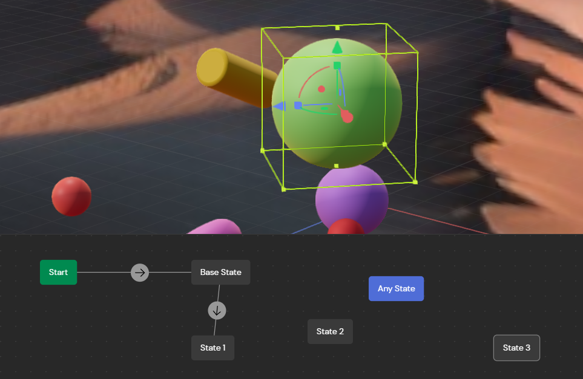

Link back to [README.md](../README.md)

---
# Reflections
- I am exploring designer's tool to prototype AR (for my own case study). 
- I spent some time polishing [my own website](www.mingzhou.design) and it turned out great.  

# Speculations
- From Julian's presentation and my own research, I can say that Bezel will be the tool for XR designers to use in the future. It requires no coding and is more interactive than *ShapesXR*.  

---
*P.S. Some photos are in my partners phone, so I will need to upload them later  for context.* 
# AR Prototyping (Bezel)
## Overview
I attended the presentation from Bezel's CEO Julian Park. I can confirm now that Bezel is the XR counterpart of *Figma*. 

The most important feature is this: 

Essentially every object in a Bezel app can have a "trigger" and "event" to be interactive. These can also be across different and multiple objects as well. This is very similar to Figma's prototyping feature. 
### Tutorial List
A list of tutorials to watch: 
- [x] [Figma Integration](https://www.youtube.com/watch?v=U2V6EgGrSm8)
- [x] [Connect Prototype to Headset](https://www.youtube.com/watch?v=cqviSEY4uLs)
- [x] [AR Mode](https://www.youtube.com/watch?v=cqviSEY4uLs)
- [ ] [Body Rig & UCD](https://www.youtube.com/watch?v=mw3Ol_fijBI)