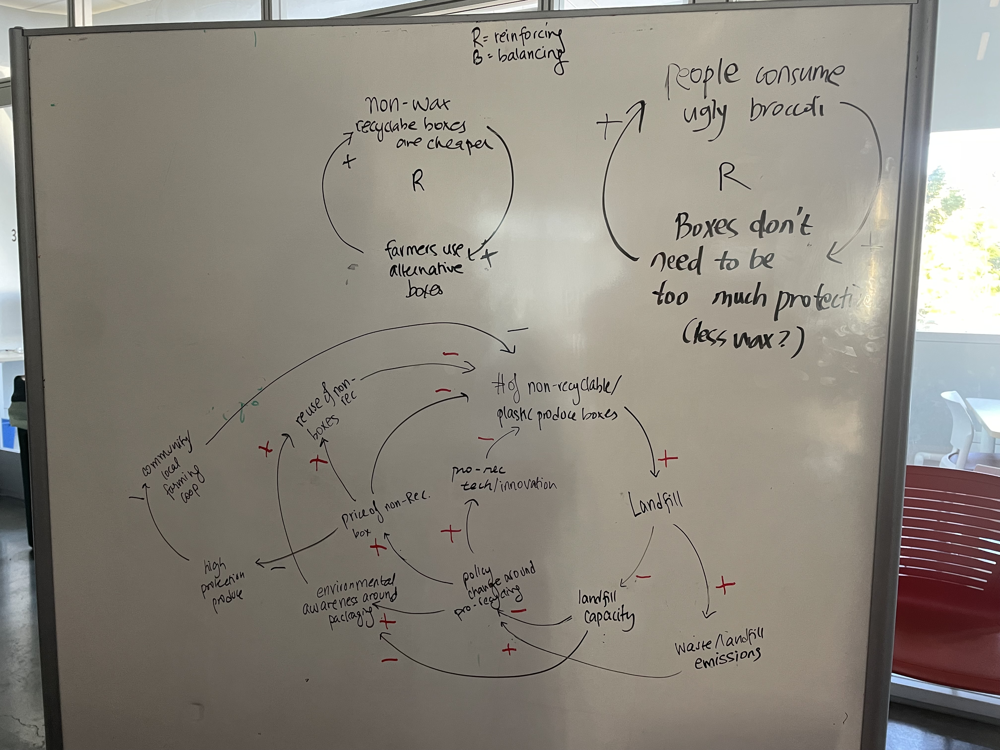
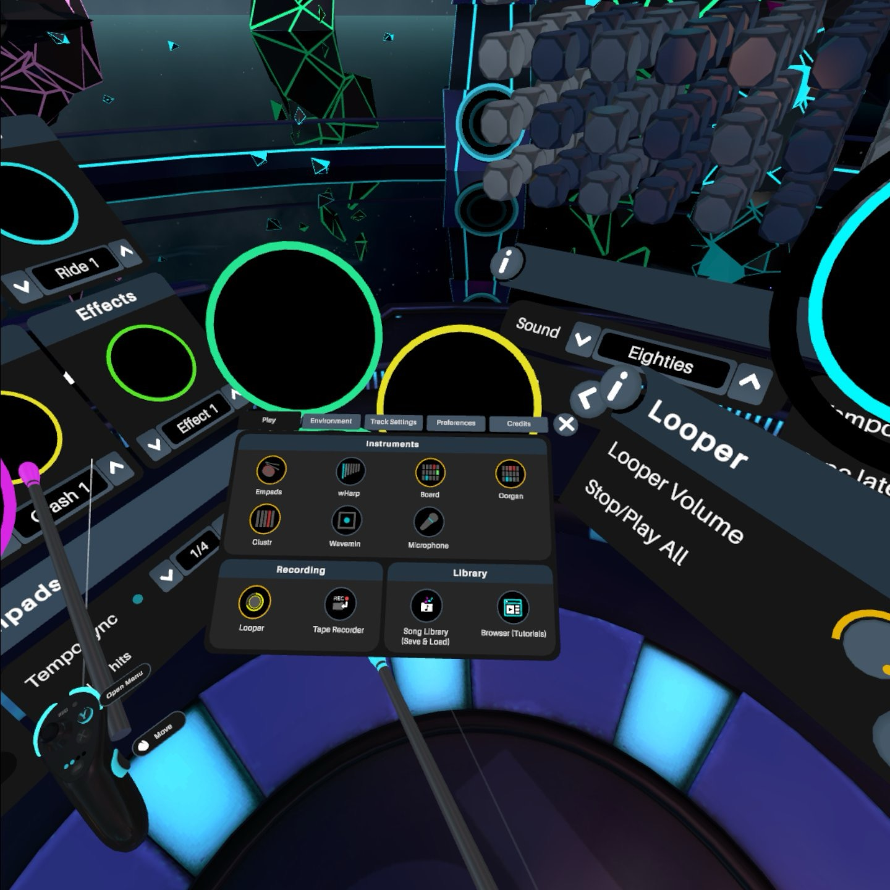

Link back to [README.md](../README.md)

---
# Reflections
- The past week I have been busier with many projects and tasks.  Time management is certainly needed more than ever. 
- I learned a mixture of soft skills like system thinking, music theory (not professionally at all), consulting tips, polymer meterials (again, not professionally)

# Speculations
- System thinking can be a framework for any problem-solving (professionally or in life), and it doesn't necessarily take long to draft. 
- Music creation seems fun ;)

---

# System Thinking

*Practice of system thinking in a sustainable packaging company context*

- **Reinforcing loop** (a -> b -> a): mechanisms within a system that amplify or reinforce a particular behavior or trend. 
- **Balancing loop**: mechanisms within a system that work to stabilize or maintain equilibrium
	- when an element or variable in the system changes in one direction, it triggers feedback mechanisms that act to counteract that change, bringing the system back towards equilibrium
- **Enablers**: facilitate or support certain behaviors or trends
- **Inhibitors**: restrain or impede certain behaviors or trends from occurring or progressing

# Music Creation
## Virtuoso VR
I created a simple loop in the program called *Virtuoso VR* on Meta Quest. Now I understand more about the music creation journey.  

## Synthesizer User Journey
*Generated from GPT 3.5*
> Creating digital music on a synthesizer involves a creative and technical process that can vary depending on the equipment and software you're using. Here's a general user journey for creating digital music on a synthesizer:
>
>1. **Inspiration and Concept**:
   - It all begins with an idea or inspiration for a musical composition. This could be a melody, a rhythm, a chord progression, or a specific mood or theme you want to convey.
>
> 2. **Selecting Your Synthesizer**:
   - Choose the synthesizer hardware or software you want to work with. This could be a physical synthesizer, a virtual synthesizer plugin within a DAW (Digital Audio Workstation), or a combination of both.
>
>3. **Setting Up Your Workspace**:
   - Ensure your synthesizer is properly connected to your computer (if using software) or audio interface (if using hardware). Make sure your MIDI controller (if you have one) is set up and functioning correctly.
>
> 4. **Sound Design**:
   - Begin by selecting or designing the sound you want to use. Synthesizers offer a wide range of possibilities, from emulating traditional instruments to creating entirely unique sounds. You can adjust parameters like oscillators, filters, envelopes, and effects to shape the sound.
> 
> 5. **Creating Musical Elements**:
   - Start composing your music. You can play melodies, chords, basslines, and other musical elements using your MIDI controller or by inputting notes manually into your DAW's piano roll or sequencer.
>
> 6. **Layering and Arranging**:
   - Experiment with layering different sounds and arranging them to create a cohesive musical piece. This might involve adding multiple synthesizer tracks with different sounds, adjusting their volumes and panning, and structuring the composition.
>
> 7. **Effects and Processing**:
   - Enhance your sounds with various effects such as reverb, delay, compression, and EQ. These effects can add depth and character to your music.
> 
> 8. **Automation and Modulation**:
   - Utilize automation and modulation to make your music more dynamic. You can automate parameters like filter cutoff, pitch, and volume to create evolving soundscapes.
>
> 9. **Recording and Editing**:
   - Record your performance or MIDI data into your DAW for further editing and fine-tuning. You can quantize, edit MIDI notes, and adjust timing to achieve precision.
>
> 10. **Mixing**:
    - Balance the levels of individual tracks, apply additional effects, and use EQ to ensure that each element of your composition fits together harmoniously. This stage is crucial for achieving a polished and professional sound.
>
> 11. **Mastering**:
    - If desired, you can master your track to prepare it for distribution. Mastering involves further processing to ensure that your music sounds consistent and competitive with other professionally produced tracks.
>
> 12. **Exporting**:
> - Export your final composition as a digital audio file, such as WAV or MP3, at the desired quality and format.
> 
> 13. **Sharing and Distribution**:
> - Share your music with others through platforms like SoundCloud, Spotify, or YouTube. You can also consider releasing your music on digital distribution services or promoting it through social media.

Another helpful resource (Youtube): 
[OP-1 03-20-18 (Aquamarine)](https://www.youtube.com/watch?v=-8sMk5KeWvg): This video is about creating music on Teenage Engineering's OP-1. The walkthrough gives me a sense of what a synthesizer can do. 
