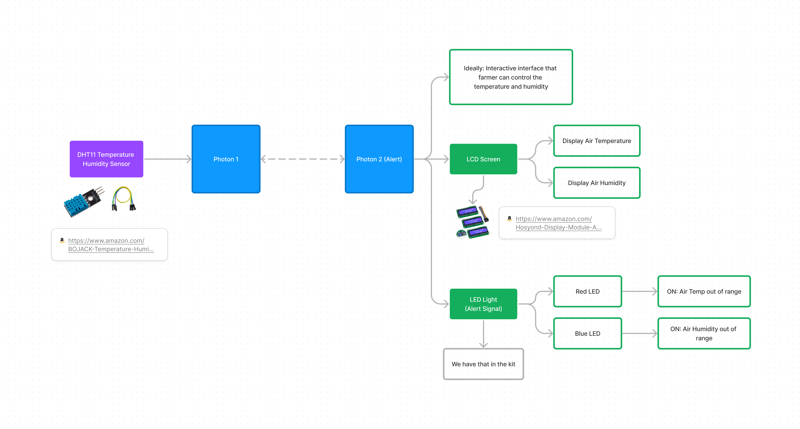
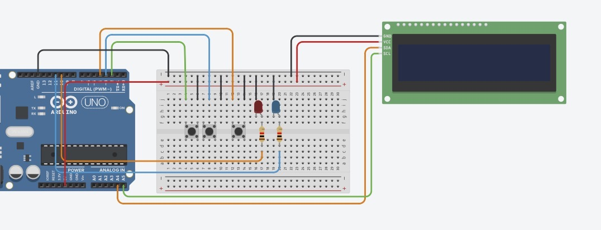

Link back to [README.md](../README.md)

---
# Reflections
- Hardware is hard. 
	- Think about the hardware first and then the software; if the code does not work, go back to the wiring. 
	- It is difficult as there are too many "variables" to consider - some sensors look the same but may not use the same library. 
- It seems complicated to go the "extra mile" for this topic. However, even with our simple design, I already experienced some headaches as I was unfamiliar with building digital systems. 
- The minor setback of being unable to detect the button press discouraged me from learning digital systems in the future at first, but I regained confidence once I resolved the issue.  

# Speculations
- Similar applications of monitoring in the farm context have existed for years. The pain point has always been the connection since many areas are remote from stations. 
- Our design showcased a demo where people would monitor anything using a long-range local network (in this case, LoRaWAN). It is successful for the demo, and more can be considered, especially in interface design, when there are more sensors in the network. 
---
# Design
If implemented in a Texas farm, the device needs to **communicate between the farmer and various sensors in the warehouse.**  The idea is to have one device for displaying sensing information (temperature and humidity) to the farmer and the other for sensing and sending over the data via **LoRaWAN technology** (Long Range Wide Area Network).


Our demo involves two computing devices talking to each other via Wi-Fi. I took in charge of the interface design for the user (farmer), which is at the right side of the diagram. 

The logic was that there were three buttons:
1. Setting
2. Add (+)
3. Minus (-)

And two LEDs:
1. Red: an indication that Heater is on; 
2. Blue: an indication that the Cooler is on. 

On the LED screen, the farmer can see the live temperature (LiveT) by default; when *LiveT* falls out of the pre-set range, the heater/cooler will be turned on, and the LEDs let the farmer know the status in the warehouse. 

The farmer can press the *setting* button to switch between 3 modes: 
1. Default: shows the live temperature reading
2. Press once: setting the maximum temperature
3. Press twice: setting the minimum temperature
4. * Press the third time: returns to the default mode



# Process
Because I lent my photon to my teammate to test connections between the two, I **started off by experimenting with sensor connections on an Arduino board** (below is the successful demo on the board). 


I first wrote the code on **TinkerCAD** and could not troubleshoot what was wrong since the simulation would not run, and **the error code message did not show anything specific.** 

I realized troubleshooting would be easier if I built the hardware incrementally and tested coding during this process. I switched to troubleshooting on both Arduino and Photon eventually. 
## Problem 1: Not Detecting Button Press



I troubleshoot using the `print()` function in my `while` loops and `if` statements and realized **the button press was not detected.** 

I tried many methods but did not succeed. I was connecting the button to the ground pin and a digital pin **without any resistor**, which caused the issue. However, I did not doubt this setup for the entire week since some people got it to work, like the tutorial below. 


When I finally connected the button to the ground pin **with a resistor**, I resolved the issue without any modification to the original code - `if digitalRead(buttonAPin) == HIGH`. 


## Problem 2: Switch Modes
I used a `while` loop to detect which mode the use chose. For example: 
```
  while (settingMode == 0) {
  	lcd_1.clear();
    lcd_1.setCursor(0, 0);
  	lcd_1.print("Live: ");
    lcd_1.setCursor(0, 1);
  	lcd_1.print(SensT);
  }
```

As Sudhu pointed out, this can cause unexpected troubles, and he suggested using `switch()` instead. Once the button press issue was resolved, I switched to that, and it just worked: 

```
switch (settingMode) {
  case 0:
    lcd.clear();  // Clear the LCD screen
    lcd.print("Max Temp:");  // Display text on the LCD
    lcd.setCursor(0,1); 
    lcd.print(MaxT);
    if (buttonBState == HIGH) {
      MaxT--;
      delay(200);
      // if (MaxT < MinT) {
      //   MaxT++;
      // }
    } else if (buttonCState == HIGH) {
      MaxT++;
      delay(200);
    break;
  case 1:
    lcd.clear();  // Clear the LCD screen
    lcd.print("Min Temp:");  // Display text on the LCD
    lcd.setCursor(0,1); 
    lcd.print(MinT);
    if (buttonBState == HIGH) {
     MinT--;
     delay(200);
    } else if (buttonCState == HIGH) {
      MinT++;
      delay(100);
      // if (MinT > MaxT) {
      //   MinT--;
      // }
    break;
  case 2: 
    lcd.clear();  // Clear the LCD screen
    lcd.print("Live Temp:");  // Display text on the LCD
    lcd.setCursor(0,1);  // Set the cursor to the top-left corner
    lcd.print(SensT);
    break;
  }
```

## Photon Wiring
Here's a photo of the wiring on photon, which is close to what I tested on the Arduino:
